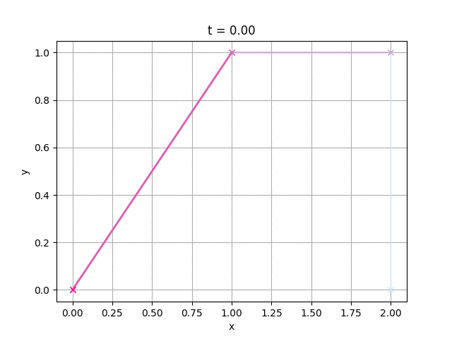

Exercise 2.10 of [Jeremy Kun's excellent book](https://pimbook.org).

`bezier.py` reads a list of control points and a step size from stdin (see `bz*.txt` for the format) and generates a number of frames animating the evaluation of the [Bézier curve](https://en.wikipedia.org/wiki/Bézier_curve) using [De Casteljau's Algorithm](https://en.wikipedia.org/wiki/De_Casteljau%27s_algorithm).



Example usage:
```sh
cat bz5.txt | python bezier.py --frames-dir frames
./mkgif.sh frames bz5.gif
```
